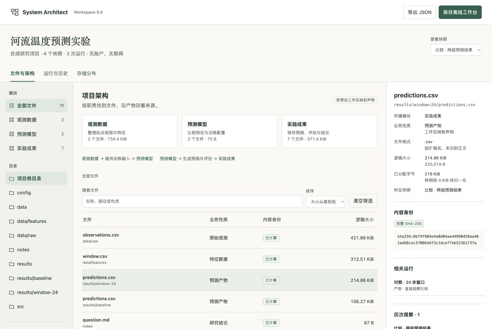
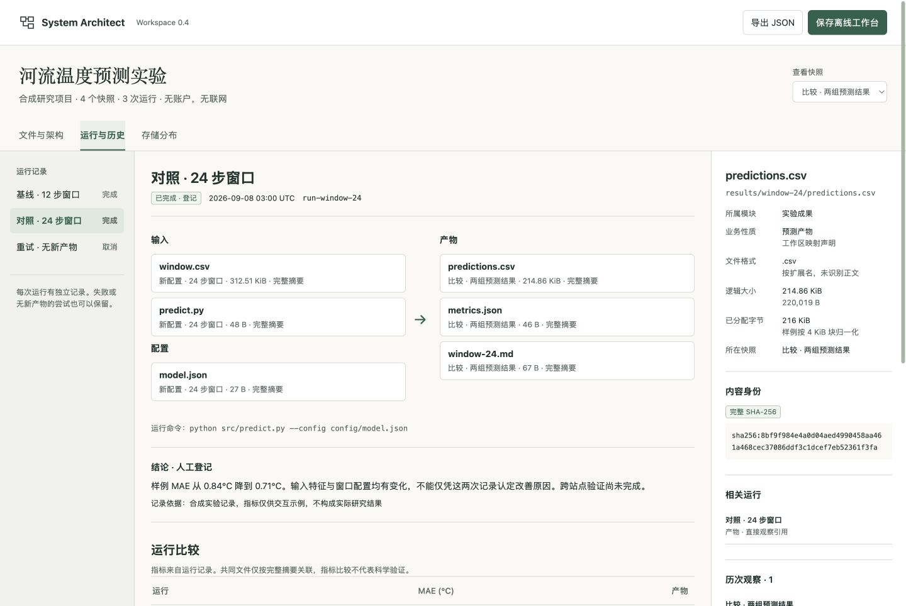
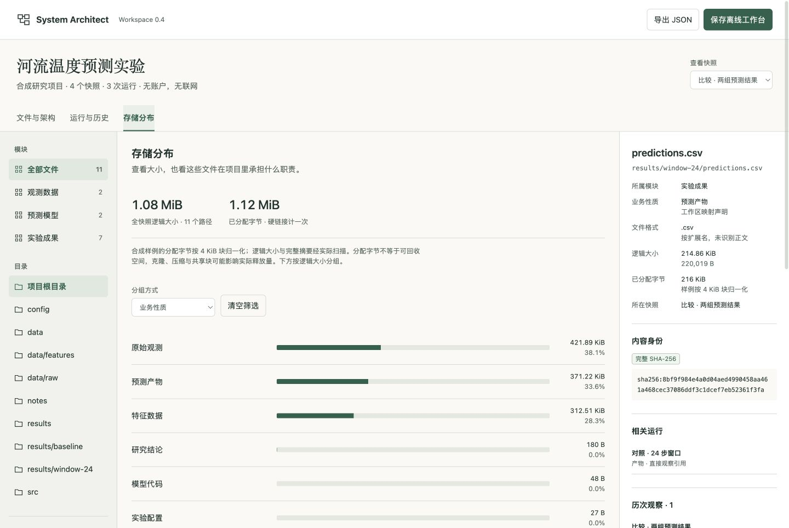

# 河流温度预测工作台

[打开在线样例](https://dengk3li.github.io/system-architect-skill/) · [下载离线版本](https://github.com/Dengk3Li/system-architect-skill/releases/tag/v0.4.0)

三个模块、四次目录快照、三次合成运行，用于体验同一份资料在架构、文件、实验历史与存储中的连接。



## 从结果追到来源

选择 `results/window-24/predictions.csv`，在详情中进入“对照 · 24 步窗口”，再打开输入 `window.csv`。该输入指向“新配置”快照中的 320,009 B 文件；基线运行指向先前 240,009 B 的版本。配置文件两次同为 27 B，但完整摘要不同。文件大小相同不能证明内容相同。



运行比較同时保留基线、对照与一次取消的尝试。快照差异可看到两个修改与三个新增文件。MAE 为虚构指标，输入特征与配置都发生了变化，不能据此归因或宣称科学验证。

## 查看空间去向

按业务性质、模块、文件扩展名或顶层目录分组，查看逻辑大小的比例与明细。已分配字节单独列出，硬链接按存储对象计一次。分配字节不能直接解释为可回收空间。



## 保存与复现

“导出 JSON”保存全部快照和运行元数据。“保存离线工作台”同时保留当前视图、快照、筛选与选中文件。浏览器可直接打开 HTML，无需服务器；它不包含原文件正文。

在仓库根目录执行：

```bash
python3 examples/research-workspace/generate.py
python3 skills/architecture-workspace/scripts/workspace.py validate examples/research-workspace/catalog.json
```

打开生成的 `index.html`。生成器只在临时目录构造合成文件，然后通过实际扫描器计算大小和完整 SHA-256。它没有访问真实实验目录，也没有运行模型训练。文件观察时间、根目录绑定、存储标识及分配字节按固定合成规则归一化，确保 macOS/Linux 生成同一份样例。4 KiB 分配规则仅属于该样例。

`catalog.json` 是完整元数据；`workspace-map.json` 是明确标注合成项目的职责与性质声明；`generate.py` 是复现入口。所有数值、名称和结论均为合成材料。截图为本仓库页面的实际浏览器捕获，来源与文件摘要见 `preview-provenance.json`。
