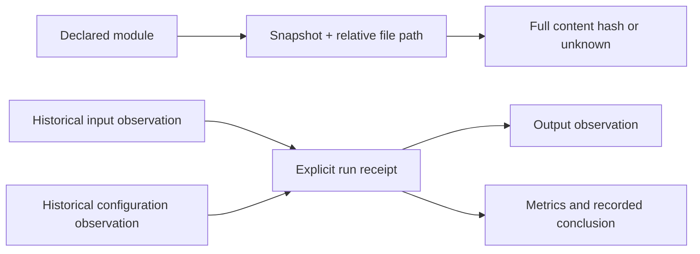

# Catalog model and operating limits

The first release is a local, append-only metadata reader. It combines architecture declarations with filesystem observations and explicit experiment receipts. It does not retain file bodies or reconstruct execution from timestamps.

## Objects and joins

| Object | Identity | Authority and meaning |
|---|---|---|
| Project | Explicit stable ID | User declaration; `synthetic` must be explicit |
| Module | Stable ID in a frozen snapshot map | Declared responsibility, path patterns and evidence |
| Relationship | ID + source/target module IDs | Declared interface or flow, with evidence; not automatically discovered |
| Snapshot | `s-` + SHA-256 of canonical snapshot fields | Observation time, scan policy, frozen map, source binding, files, coverage and totals |
| File observation | Snapshot ID + normalized relative path | Observed size, allocation, modification time, extension and declared classifications |
| Content | `sha256:` + full 64-character digest | Full stable bytes, or null with a precise unknown reason |
| Run | Explicit unique ID + receipt digest | Independently recorded attempt; inputs, configs, outputs and conclusions refer to exact observations |
| Storage object | Snapshot-local device/inode digest | Count hardlinked allocation once within that snapshot; not a portable content ID |



One catalog contains one project and one bound source directory. The source binding hashes the resolved root path and device/inode; it omits the absolute path from the catalog. Moving a root or using another machine may require a new catalog. This guard detects accidental mixing; it is not authenticated provenance.

The synthetic flag must agree between the catalog and every snapshot; changing only the top-level label fails validation. Aggregate counts and bytes must fit JavaScript safe integers before rendering.

Snapshot maps are frozen. Updating the current map cannot relabel historical observations. Equality uses full content digests only. Equal digests at two paths mean equal bytes; they do not prove either copy is safe to delete. Cross-snapshot paths do not become renamed-file identities automatically.

## Map format

See the template for an empty map and the synthetic example for a populated one. A module requires `id`, `title`, `purpose`, `paths`, and `evidence`. A relationship requires `id`, `source`, `target`, `label`, and `evidence`. Nature rules contain `pattern` and `nature`. Exclusions are relative glob patterns.

Paths are normalized POSIX strings, case-sensitive and relative. Absolute paths, backslashes, colons, control characters, `.` and `..` components are rejected. Literal file paths containing glob characters are skipped with partial coverage. Pattern matching uses Python fnmatch: `*` spans separators. Overlapping modules and conflicting nature rules fail instead of picking an arbitrary rule. No match remains unclassified.

`map-from-boundaries` reuses owned paths from the existing v1 boundary manifest and provider-to-consumer interface declarations. Validate that manifest using the architect checker first. Business nature remains a separate, explicitly supplied mapping.

## Run receipt

Replace the snapshot IDs and paths below with observed catalog references. These identifiers illustrate the format and cannot be imported as real evidence.

```json
{
  "schema": "system-architect.run/v1",
  "id": "run-20260908-01",
  "title": "Baseline evaluation",
  "status": "completed",
  "started_at": "2026-09-08T02:00:00Z",
  "ended_at": "2026-09-08T02:05:00Z",
  "command": "python src/evaluate.py --config config/model.json",
  "inputs": [{"snapshot_id": "REPLACE_WITH_BEFORE_ID", "path": "data/input.csv"}],
  "config": [{"snapshot_id": "REPLACE_WITH_BEFORE_ID", "path": "config/model.json"}],
  "outputs": [{"snapshot_id": "REPLACE_WITH_AFTER_ID", "path": "results/metrics.json"}],
  "metrics": {},
  "conclusion": "Evaluation completed; measured metrics belong in this receipt after verification.",
  "evidence": "Replace with the actual run log or verified record reference."
}
```

Statuses are `completed`, `failed`, or `cancelled`. All three reference arrays are required but may be empty. Each reference joins a specific snapshot/path. The importer fills its content ID from that observation and rejects an inconsistent supplied ID. The run exists even with no new file or changed hash. Metrics are finite numbers within JavaScript's safe range; scientific interpretation and comparability remain the researcher's responsibility.

The receipt digest covers the stored normalized record. Snapshot digests cover the entire frozen observation. Validation detects accidental edits and broken joins. A person can alter a catalog and recompute its digests; neither is a signature, attestation, or independent execution audit.

## Read and write behavior

The scanner opens the explicit root without following a root symlink, traverses directory descriptors without following symlinks, and reads regular files only. Default hidden/dependency/credential exclusions are a convenience, not proof that every private item has been excluded. It stores no bodies and never creates sidecars in the source. Reads can update access times. Network or cloud-synced filesystems may hydrate files while reading; choose a source and hashing budget appropriate to that environment.

The scanner compares file identity, size, modification/change times and byte count before and after hashing. Detected changes invalidate the digest. This is not a globally atomic filesystem snapshot; quiesce producers or scan a genuine filesystem snapshot when that level of consistency matters.

The CLI rejects catalogs inside the scanned root. Catalog writes use a POSIX advisory lock and atomic replacement; interrupted writes preserve the earlier complete catalog. The empty `.lock` remains beside the catalog. Locks coordinate this CLI's writers, not unrelated programs. Only metadata is written, to the explicit output location. Scanning/writes require macOS or Linux; the HTML reader is browser-based.

## Comparison and storage

- Both paths present, both full hashes equal: unchanged content.
- Both full hashes differ: modified content.
- Either digest missing: unknown content, even when size and modification time match.
- Path absent from a complete, observed comparison scope: added or removed.
- Missing path inside excluded/unreadable/partial scope: unobserved before or after, not a deletion claim.

Logical size counts every path. Allocated bytes use filesystem-reported blocks and count hardlinks once per snapshot. If allocation is unknown or inconsistent for a storage object, the snapshot allocation is unknown. Compression, clones, sparse files and shared blocks prevent interpreting this total as reclaimable space. Extension labels do not identify MIME type or business meaning.

The default limit is 100,000 observed files; reaching it marks partial coverage. Each eligible file is fully hashed up to 16 MiB by default. Raising the limit increases disk I/O; there is no universal performance benchmark in this release. Catalogs load fully into memory. File lists paginate at 200; directory navigation and difference previews show their first 200 entries. Full catalog/diff JSON retains all observed records.

## Export and privacy

HTML embeds validated JSON, CSS and JavaScript with no external assets or API calls. Catalog text is escaped before script embedding and UI values are escaped on insertion. A content-security policy blocks connections, objects and forms. Exported HTML includes the current view, snapshot, selection and filters. JSON contains the complete metadata catalog without navigation state.

Relative names, command text and conclusions can still be private. Share only a reviewed catalog within existing authorization. Export is metadata preservation, not a file backup. Old bytes cannot be restored from a digest.
